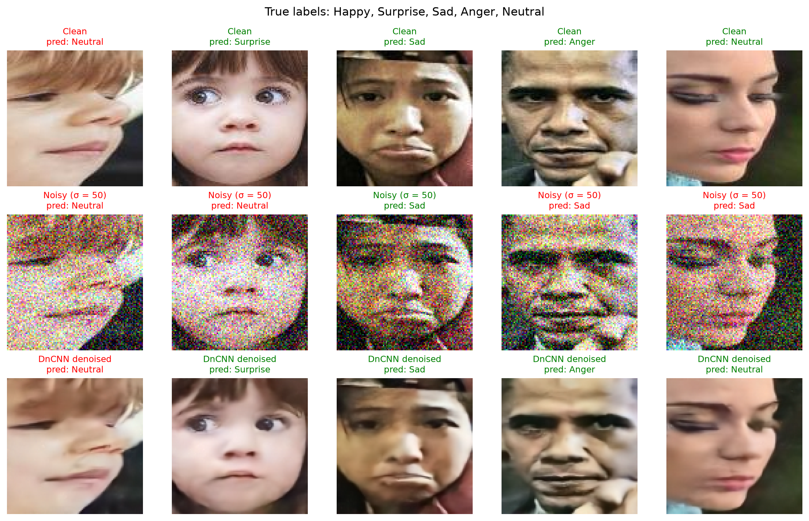
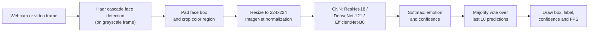

# FacialNet

[](https://github.com/SabariLRM/FacialNet/actions/workflows/ci_pipeline.yml)


FacialNet is a deep learning **Facial Emotion Recognition (FER)** system. It classifies a face into one of seven basic emotions (anger, disgust, fear, happiness, sadness, surprise and neutral) and runs both on still images and on live webcam or video streams.

The project compares three ImageNet-pretrained CNN backbones, **ResNet-18**, **DenseNet-121** and **EfficientNet-B0**, fine-tuned with transfer learning on two benchmark datasets: **FER2013** (grayscale) and **RAF-DB** (color). A **DnCNN** denoiser makes the models robust to noisy camera images.

## Contents

- [Highlights](#highlights)
- [Results](#results)
- [How It Works](#how-it-works)
- [Getting Started](#getting-started)
- [Training](#training)
- [Inference](#inference)
- [Repository Structure](#repository-structure)
- [Model Weights](#model-weights)
- [Continuous Integration](#continuous-integration)
- [Limitations and Known Issues](#limitations-and-known-issues)
- [Datasets and Acknowledgements](#datasets-and-acknowledgements)

## Highlights

- **Three backbones, one recipe:** ResNet-18, DenseNet-121 and EfficientNet-B0 trained with the same data pipeline and hyperparameters, so results compare directly.
- **Real-time video emotion tracking:** OpenCV face detection, per-face emotion classification with softmax confidence, temporal smoothing and an FPS counter.
- **Augmentation for real-world faces:** random zoom, flips, rotation, brightness and contrast changes and random occlusion keep clean RAF-DB accuracy the same, but make the models 2–9 points more accurate on dark, low-contrast, partly covered or tightly cropped faces.
- **Noise robustness with DnCNN:** Gaussian noise cuts average RAF-DB accuracy from 87.2% to 34.8% (σ = 50); a DnCNN denoiser fine-tuned on faces restores it to 78.4%, and can clean every face in the live video pipeline.
- **Static image prediction:** single-image scripts for the FER2013 models.
- **Runs anywhere PyTorch does:** the RAF-DB notebooks pick NVIDIA CUDA, Apple Silicon (`mps`) or CPU automatically, and work unchanged on Kaggle or locally.
- **Notebooks with results:** the training notebooks are saved with their outputs, including per-epoch loss and accuracy and training curves; the RAF-DB notebooks also report per-class test accuracy.

## Results

### RAF-DB (color, 7 classes, 3,068 test images)

Trained for 12 epochs on an Apple M4 MacBook Air using the `mps` backend, with the augmentation described in [Preprocessing and augmentation](#preprocessing-and-augmentation). Time per epoch is the wall-clock time of one uninterrupted training and test pass.

| Model | Parameters | Weights file | Time per epoch | Test accuracy |
| --- | --- | --- | --- | --- |
| ResNet-18 | 11.2M | 45 MB | 2.0 min | 87.03% |
| DenseNet-121 | 7.0M | 28 MB | 5.2 min | **87.45%** |
| EfficientNet-B0 | 4.0M | 16 MB | 3.8 min | 87.06% |

The three models are within 0.5 points of each other, which is within run-to-run noise (see [Effect of data augmentation](#effect-of-data-augmentation-raf-db)). EfficientNet-B0 gets there with about a third of ResNet-18's parameters.

Per-class test accuracy:

| Emotion (test images) | ResNet-18 | DenseNet-121 | EfficientNet-B0 |
| --- | --- | --- | --- |
| Surprise (329) | **89.4%** | 88.4% | 87.2% |
| Fear (74) | **63.5%** | 54.1% | 58.1% |
| Disgust (160) | 58.8% | 54.4% | **62.5%** |
| Happy (1,185) | **94.1%** | 93.9% | 93.0% |
| Sad (478) | 85.8% | 87.9% | **90.6%** |
| Anger (162) | 82.7% | **85.8%** | 78.4% |
| Neutral (680) | 84.7% | **87.2%** | 85.1% |

Fear and Disgust are the hardest classes for every model. They are also the least represented in the training set (see [Datasets](#datasets)).

### FER2013 (grayscale, 7 classes)

Trained for 15 epochs on Kaggle (NVIDIA Tesla T4) with mixed precision.

| Model | Test accuracy |
| --- | --- |
| ResNet-18 | 69.53% |
| DenseNet-121 | **71.58%** |

FER2013 is considerably harder than RAF-DB: its images are 48×48 grayscale with noisier labels.

All numbers above are the test accuracy after the final epoch, as printed in the notebooks.

### Effect of data augmentation (RAF-DB)

The first version of the RAF-DB models was trained with only a horizontal flip and ±15° rotation. The current models add random zoom, brightness and contrast changes and random occlusion (see [Preprocessing and augmentation](#preprocessing-and-augmentation)); everything else in the recipe is unchanged. Both versions were evaluated on the same test images, so each comparison is paired: the confidence interval is a bootstrap over test images, and the p-value is an exact McNemar test on the images that only one version classifies correctly.

On the clean test set, the extra augmentation makes no significant difference:

| Model | Flip + rotation | Full augmentation | Difference (95% CI) | McNemar p |
| --- | --- | --- | --- | --- |
| ResNet-18 | 86.90% | 87.03% | +0.13 (−0.91 to +1.17) | 0.85 |
| DenseNet-121 | 87.48% | 87.45% | −0.03 (−1.04 to +0.98) | 1.00 |
| EfficientNet-B0 | 87.42% | 87.06% | −0.36 (−1.37 to +0.62) | 0.52 |

The two versions of each model disagree on 240–265 of the 3,068 test images, even though their accuracies are almost equal. Differences of about 1 point between single training runs, including between the three backbones, are therefore within run-to-run noise.

The extra augmentation does reduce overfitting: final training accuracy falls from 98.2–98.8% to 92.8–96.0%. It also makes every model clearly more robust when the test faces are changed at test time:

| Test condition | ResNet-18 | DenseNet-121 | EfficientNet-B0 |
| --- | --- | --- | --- |
| Clean | 86.9% → 87.0% | 87.5% → 87.5% | 87.4% → 87.1% |
| Dark (brightness × 0.5) | 85.3% → 86.9% | 85.1% → 87.0% | 85.2% → 87.1% |
| Low contrast (contrast × 0.5) | 84.7% → 86.7% | 85.1% → 87.2% | 85.3% → 87.2% |
| Occluded (random box covering 5–15% of the face) | 80.5% → 84.2% | 80.0% → 85.0% | 82.8% → 85.4% |
| Tight crop (central 80% of the face) | 73.9% → 83.4% | 79.3% → 84.8% | 82.7% → 85.2% |

Every change in the four harder conditions is significant (McNemar p < 0.005). Without the extra augmentation the models lose up to 13 points under these conditions; with it they lose at most 4. The halved brightness and contrast and the 80% crop are stronger than anything seen in training, and all four conditions are common in webcam frames: poor lighting, hands or hair over the face, and detector boxes that crop differently from RAF-DB's alignment.

### Noise robustness with DnCNN (RAF-DB)

Gaussian noise at σ = 15, 25 and 50 (0–255 scale) was added to the 3,068 RAF-DB test faces, which were then classified as-is and after denoising with DnCNN (see [Denoising](#denoising)).

Denoising quality, PSNR (dB) / SSIM against the clean faces:

| Noise σ | Noisy input | Pretrained DnCNN | DnCNN fine-tuned on RAF-DB |
| --- | --- | --- | --- |
| 15 | 24.82 / 0.572 | 34.94 / 0.943 | **34.99 / 0.945** |
| 25 | 20.53 / 0.384 | 32.09 / 0.909 | **32.50 / 0.916** |
| 50 | 14.99 / 0.185 | 27.54 / 0.833 | **28.76 / 0.848** |

Emotion accuracy on noisy faces, before and after the fine-tuned DnCNN:

| Model | Clean | σ = 15 noisy → denoised | σ = 25 noisy → denoised | σ = 50 noisy → denoised |
| --- | --- | --- | --- | --- |
| ResNet-18 | 86.86% | 81.49% → 85.40% | 73.79% → 84.16% | 38.43% → 78.29% |
| DenseNet-121 | 87.42% | 82.43% → 86.21% | 75.95% → 84.65% | 49.45% → 78.62% |
| EfficientNet-B0 | 87.22% | 56.36% → 85.85% | 18.84% → 84.35% | 16.56% → 78.19% |

- Noise hurts every model, and EfficientNet-B0 most of all: it falls to 18.84% at σ = 25.
- Denoising first brings all three models back to within 1.5 points of clean accuracy at σ = 15, within 3 points at σ = 25, and to about 78% at σ = 50.
- Fine-tuning DnCNN on faces adds 0.4 dB PSNR at σ = 25 and 1.2 dB at σ = 50 over the authors' pretrained model.
- These numbers were measured with the first version of the RAF-DB models (flip and rotation only; see [Effect of data augmentation](#effect-of-data-augmentation-raf-db)). The clean column resizes images on the GPU, so it differs from those models' PIL-resize accuracy by up to 0.2 points.



## How It Works

### Datasets

| | FER2013 | RAF-DB |
| --- | --- | --- |
| Images | 48×48 grayscale | 100×100 color, aligned faces |
| Train / test | 28,709 / 7,178 | 12,271 / 3,068 |
| Folder labels | `angry`, `disgust`, `fear`, `happy`, `neutral`, `sad`, `surprise` | `1`–`7` (see below) |
| Used in | `Image prediction/`, root notebooks | `Video Predicition/` |

RAF-DB folder numbers map to emotions as follows. The training-set counts show the strong class imbalance:

| Folder | Emotion | Train images | Test images |
| --- | --- | --- | --- |
| `1` | Surprise | 1,290 | 329 |
| `2` | Fear | 281 | 74 |
| `3` | Disgust | 717 | 160 |
| `4` | Happy | 4,772 | 1,185 |
| `5` | Sad | 1,982 | 478 |
| `6` | Anger | 705 | 162 |
| `7` | Neutral | 2,524 | 680 |

Both datasets use the `ImageFolder` layout (`train/<class>/*.jpg`, `test/<class>/*.jpg`), so class indices follow the sorted folder names.

### Preprocessing and augmentation

All models take 224×224, 3-channel input normalized with ImageNet mean and standard deviation, matching the pretrained backbones.

| Step | FER2013 | RAF-DB |
| --- | --- | --- |
| Resize | 224×224 | 224×224 |
| Color | Grayscale copied to 3 channels | Native RGB |
| Train augmentation | Horizontal flip, rotation ±10° (DenseNet-121 also translates up to 10%) | See below |
| Normalization | ImageNet mean/std | ImageNet mean/std |

The RAF-DB training images are augmented on the fly, so every epoch sees a different version of each face. Test images are only resized and normalized.

| RAF-DB augmentation | Setting | Simulates |
| --- | --- | --- |
| Random zoom (`RandomResizedCrop`) | Crop 85–100% of the area, aspect ratio 0.9–1.1, resize to 224×224 | Face detector boxes of different sizes |
| Horizontal flip | 50% of images | Left and right sides of the face |
| Rotation | Up to ±15° | Head tilt |
| Brightness and contrast (`ColorJitter`) | ±30% each | Lighting and camera exposure |
| Random erasing | 25% of images, a box covering 2–33% of the image | Hands, hair or glasses covering part of the face |

### Models

Each backbone is loaded with torchvision ImageNet weights, and only its final classification layer is replaced with a 7-way head:

| Backbone | Replaced layer | RAF-DB head | FER2013 head |
| --- | --- | --- | --- |
| ResNet-18 | `model.fc` | `Dropout(0.5)` → `Linear(512, 7)` | `Linear(512, 7)` |
| DenseNet-121 | `model.classifier` | `Dropout(0.5)` → `Linear(1024, 7)` | `Linear(1024, 7)` |
| EfficientNet-B0 | `model.classifier` | `Dropout(0.5)` → `Linear(1280, 7)` | `Dropout(0.2)` → `Linear(1280, 7)` |

The whole network is fine-tuned; no layers are frozen.

### Training recipe

| Setting | RAF-DB notebooks | FER2013 notebooks (`Image prediction/`) |
| --- | --- | --- |
| Optimizer | AdamW, lr 1e-4, weight decay 0.01 | AdamW, lr 1e-4, weight decay 0.01 |
| LR schedule | OneCycleLR, max lr 1e-3 | OneCycleLR, max lr 1e-3 |
| Loss | Cross-entropy, label smoothing 0.1 | Cross-entropy |
| Batch size | 64 | 64 |
| Epochs | 12 | 15 |
| Random seed | 42 (`torch.manual_seed`) | Not set |
| Mixed precision | On CUDA only (float32 on `mps`/CPU) | CUDA AMP |

The scheduler only steps when the mixed-precision grad scaler actually applied an optimizer step, which keeps OneCycleLR in sync when AMP skips a step.

The root notebooks `resnet_model.ipynb` and `densenet_model.ipynb` are the original FER2013 baselines: SGD (lr 1e-3, momentum 0.9), batch size 32, 10 epochs, no scheduler.

### Denoising

`Denoising/denoising.ipynb` adds noise to RAF-DB and trains the denoiser:

- **Noise model:** additive white Gaussian noise, $y = \mathrm{clip}(x + n, 0, 1)$ with $n \sim \mathcal{N}(0, \sigma^2)$, independent for every pixel and RGB channel. Noise is added on the fly, so the dataset on disk stays clean.
- **Training noise:** a random σ from 0 to 55 for every patch, so one blind model handles all noise levels.
- **Test noise:** σ = 15, 25 and 50 with a fixed random seed, so every model sees the same noisy test set.
- **Model:** DnCNN (Zhang et al., IEEE TIP 2017): 20 convolution layers with 64 3×3 filters and ReLU, with Batch Normalization merged into the convolutions in the released weights (668,227 parameters). It uses residual learning: the network predicts the noise map, which is subtracted from the noisy input.
- **Weights:** starts from the authors' color blind model `dncnn_color_blind.pth` from [KAIR](https://github.com/cszn/KAIR) (downloaded automatically), then fine-tunes on 40×40 RAF-DB face patches for 8 epochs (Adam, learning rate 1e-5 with a 50-step warmup and cosine decay, 7 minutes on an Apple M4). A learning rate of 1e-4 destroyed the pretrained weights within a few steps.

### Real-time video pipeline



1. **Detect:** OpenCV's `haarcascade_frontalface_default.xml` (`scaleFactor=1.3`, `minNeighbors=5`) finds faces in a grayscale copy of the frame.
2. **Crop:** each face box is padded (5% for DenseNet-121 and EfficientNet-B0, 20% for ResNet-18), clipped to the frame and cropped from the color frame.
3. **Classify:** the crop is converted BGR→RGB, preprocessed like the test set and passed through the network; softmax gives the class probabilities.
4. **Smooth:** the most frequent emotion among the last 10 predictions is displayed, which removes frame-to-frame flicker.
5. **Display:** a bounding box, the smoothed emotion, the current frame's confidence and an FPS counter are drawn on the frame.

## Getting Started

### Requirements

- Python 3 with `pip`
- An NVIDIA GPU (CUDA), an Apple Silicon Mac (`mps`) or a CPU; a GPU is strongly recommended for training
- A webcam for live video inference
- Disk space for the datasets (RAF-DB is about 60 MB) and the model weights (about 90 MB for the three RAF-DB models)

Tested with Python 3.14, PyTorch 2.14, torchvision 0.29 and OpenCV 4.14 on macOS (Apple M4). The original notebooks were run on Kaggle.

### Installation

```bash
git clone https://github.com/SabariLRM/FacialNet.git
cd FacialNet
python3 -m venv .venv
source .venv/bin/activate
pip install -r requirements.txt
```

`opencv-python` is pinned below 5.0 because OpenCV 5 removed `cv2.CascadeClassifier`, which the video scripts use for face detection.

### Download the datasets

The datasets are not committed to the repository; `/data` is gitignored.

**RAF-DB** (needed for the `Video Predicition/` notebooks) goes into `data/raf-db`:

```bash
python -c "import kagglehub, shutil; p = kagglehub.dataset_download('shuvoalok/raf-db-dataset'); shutil.copytree(p + '/DATASET', 'data/raf-db')"
```

**FER2013** (needed for the `Image prediction/` notebooks) is available on Kaggle as [`msambare/fer2013`](https://www.kaggle.com/datasets/msambare/fer2013). It contains `train/` and `test/` folders. On Kaggle, attach the dataset to the notebook; to run locally, download it and point `data_dir` at the folder.

## Training

### RAF-DB models (ResNet-18, DenseNet-121, EfficientNet-B0)

The three notebooks in `Video Predicition/` share the same setup code. They pick CUDA, `mps` or CPU automatically, and read data from Kaggle's input folder when it exists, otherwise from `../data/raf-db`.

Open a notebook in Jupyter and run all cells, or execute it from the command line:

```bash
cd "Video Predicition"
jupyter nbconvert --to notebook --execute --inplace efficientnet.ipynb --ExecutePreprocessor.timeout=-1
```

Replace `efficientnet.ipynb` with `resnet-model.ipynb` or `densenet.ipynb` for the other models. Each notebook:

1. Loads RAF-DB and prints the detected classes and image counts.
2. Builds the pretrained backbone with a new 7-way head.
3. Trains for 12 epochs, printing train/test loss, accuracy and epoch time.
4. Plots loss and accuracy curves and saves the weights next to the notebook (for example `efficientnet_b0_rafdb_final.pth`).
5. Prints overall and per-class test accuracy.

### DnCNN denoiser

Run `Denoising/denoising.ipynb` after training the three RAF-DB classifiers (it loads their weights from `Video Predicition/` for the accuracy evaluation):

```bash
cd Denoising
jupyter nbconvert --to notebook --execute --inplace denoising.ipynb --ExecutePreprocessor.timeout=-1
```

It downloads the pretrained DnCNN, fine-tunes it, and saves `dncnn_rafdb_finetuned.pth`, `results.json` and the figures `noise_levels.png`, `denoising_examples.png` and `fer_accuracy_vs_noise.png`. Set `max_train_batches` and `max_test_batches` in the data cell to small numbers for a quick test run.

### FER2013 models

`Image prediction/resnet-model.ipynb` and `Image prediction/densenet.ipynb` train on FER2013. They were written for Kaggle GPU notebooks: `data_dir` points at `/kaggle/input/datasets/msambare/fer2013`, and training uses CUDA mixed precision. Running them elsewhere needs a CUDA GPU and an updated `data_dir`.

## Inference

### Live webcam or video file

Run the video scripts from inside `Video Predicition/`, because they load the weights from the current directory:

```bash
cd "Video Predicition"
python video_inference_efficientnet.py
```

Press `q` to quit. On macOS, allow camera access for your terminal the first time.

The EfficientNet script also accepts a video file, and `--denoise` cleans each detected face with the fine-tuned DnCNN before classifying it (this roughly halves the frame rate):

```bash
python video_inference_efficientnet.py path/to/video.mp4
python video_inference_efficientnet.py --denoise
```

On a test video with σ = 25 noise, the plain model mislabeled the faces at low confidence, while `--denoise` gave the same emotions as on the clean video.

| Script | Weights | Devices | Face padding |
| --- | --- | --- | --- |
| `video_inference_efficientnet.py` | `efficientnet_b0_rafdb_final.pth` | CUDA, `mps`, CPU | 5% |
| `video_inference_densnet.py` | `densenet121_rafdb_final.pth` | CUDA, CPU | 5% |
| `video_inference_resnet.py` | `resnet18_rafdb_final.pth` | CUDA, CPU | 20% |

For `video_inference_resnet.py` and `video_inference_densnet.py`, change `VIDEO_SOURCE = 0` in the script to a file path to use a video file.

### Single image (FER2013 models)

The scripts in `Image prediction/` load FER2013 weights, predict the emotion of one image and show it with matplotlib. Put the weights file and your image in `Image prediction/`, change the file name in the last line of the script (`predict('image copy.png')` or `predict_emotion('image copy.png')`), then run:

```bash
cd "Image prediction"
python resnet.py
```

## Repository Structure

```text
FacialNet/
├── .github/workflows/
│   └── ci_pipeline.yml               # Lint and notebook conversion checks on push / PR
├── Image prediction/                 # FER2013 (grayscale) models
│   ├── resnet-model.ipynb            # ResNet-18 training on Kaggle (15 epochs, AMP)
│   ├── densenet.ipynb                # DenseNet-121 training on Kaggle (15 epochs, AMP)
│   ├── resnet.py                     # Single-image prediction with ResNet-18
│   ├── densenet.py                   # Single-image prediction with DenseNet-121
│   └── efficientnet.py               # Single-image prediction with EfficientNet-B0
├── Video Predicition/                # RAF-DB (color) models and real-time inference
│   ├── resnet-model.ipynb            # ResNet-18 training
│   ├── densenet.ipynb                # DenseNet-121 training
│   ├── efficientnet.ipynb            # EfficientNet-B0 training
│   ├── video_inference_resnet.py     # Webcam / video emotion recognition, ResNet-18
│   ├── video_inference_densnet.py    # Webcam / video emotion recognition, DenseNet-121
│   └── video_inference_efficientnet.py  # Webcam / video emotion recognition, EfficientNet-B0 (optional --denoise)
├── Denoising/                        # Noise robustness study
│   ├── denoising.ipynb               # Gaussian noise, DnCNN fine-tuning and evaluation
│   ├── results.json                  # PSNR/SSIM and accuracy numbers
│   └── *.png                         # Noise levels, denoising examples, accuracy vs noise
├── resnet_model.ipynb                # Original FER2013 baseline, ResNet-18 (SGD)
├── densenet_model.ipynb              # Original FER2013 baseline, DenseNet-121 (SGD)
├── data/                             # Datasets, created locally (gitignored)
├── requirements.txt                  # Python dependencies
└── .gitignore                        # Ignores /data, *.pth weights and .venv/
```

## Model Weights

Trained weights (`*.pth`) are gitignored and not published in the repository. Train them with the notebooks, or place previously trained files in the folder shown.

| File | Folder | Produced by | Used by |
| --- | --- | --- | --- |
| `resnet18_rafdb_final.pth` | `Video Predicition/` | `resnet-model.ipynb` | `video_inference_resnet.py` |
| `densenet121_rafdb_final.pth` | `Video Predicition/` | `densenet.ipynb` | `video_inference_densnet.py` |
| `efficientnet_b0_rafdb_final.pth` | `Video Predicition/` | `efficientnet.ipynb` | `video_inference_efficientnet.py` |
| `dncnn_color_blind.pth` | `Denoising/` | Downloaded from KAIR by `denoising.ipynb` | `denoising.ipynb` |
| `dncnn_rafdb_finetuned.pth` | `Denoising/` | `denoising.ipynb` | `video_inference_efficientnet.py --denoise` |
| `resnet18_fer2013_optimized.pth` | `Image prediction/` | `resnet-model.ipynb` | `resnet.py` |
| `densenet121_fer2013.pth` | `Image prediction/` | `densenet.ipynb` | `densenet.py` (expects `densenet121_fer2013(1).pth`) |
| `efficientnet_b0_fer2013_amp.pth` | `Image prediction/` | Not included in this repository | `efficientnet.py` |

The FER2013 DenseNet-121 and EfficientNet-B0 scripts strip the `_orig_mod.` prefix from checkpoint keys, so they also load weights saved from a `torch.compile`d model.

## Continuous Integration

`.github/workflows/ci_pipeline.yml` runs on every push and pull request to `main`:

1. Sets up Python 3.9 and installs `requirements.txt`.
2. Converts `resnet_model.ipynb` and `densenet_model.ipynb` to Python scripts with `nbconvert`.
3. Runs `flake8`. The build fails on syntax errors and undefined names (`E9`, `F63`, `F7`, `F82`); all other style issues are reported as warnings.

CI checks that the code is valid Python; it does not train or evaluate models.

## Limitations and Known Issues

### Limitations

- **Class imbalance:** RAF-DB has 17× more Happy than Fear training images, and Fear and Disgust are the weakest classes for every model. Class-weighted loss or oversampling would likely help.
- **No separate validation split:** the test set is evaluated after every epoch. Reported numbers are final-epoch results, not the best epoch, but there is no held-out validation set.
- **Face detection:** the Haar cascade only finds roughly frontal faces and is sensitive to lighting, head pose and occlusion. When it misses a face, no emotion is shown.
- **Crop mismatch:** RAF-DB faces are tightly aligned, while webcam crops come from a detector box. More padding adds background and lowers accuracy. Random zoom during training reduces the effect of tighter crops (see [Effect of data augmentation](#effect-of-data-augmentation-raf-db)), but looser crops with extra background were not tested.
- **Synthetic noise only:** the denoiser is trained and evaluated on additive Gaussian noise. Real camera noise also includes compression artifacts, blur and signal-dependent noise, which were not tested.
- **Confidence display:** the label shown in the video scripts is smoothed over 10 frames, but the percentage next to it is the current frame's confidence.

### Known issues

- **FER2013 label order in `Image prediction/`:** `resnet.py`, `densenet.py`, `efficientnet.py` and the visualization cell of `densenet.ipynb` use `['Angry', 'Disgust', 'Fear', 'Happy', 'Sad', 'Surprise', 'Neutral']`. `ImageFolder` sorts the FER2013 folders alphabetically (`angry, disgust, fear, happy, neutral, sad, surprise`), so Neutral, Sad and Surprise predictions are displayed under the wrong names. The list should follow the alphabetical order.
- **Weights file name:** `Image prediction/densenet.py` loads `densenet121_fer2013(1).pth`, but `Image prediction/densenet.ipynb` saves `densenet121_fer2013.pth`.
- **Missing notebook:** there is no training notebook for the FER2013 EfficientNet-B0 model that `Image prediction/efficientnet.py` loads.
- **Video script devices:** `video_inference_resnet.py` and `video_inference_densnet.py` use CUDA or CPU only, so they run on the CPU on Apple Silicon.
- **ResNet video script:** `video_inference_resnet.py` labels its predictions "DenseNet" and uses 20% face padding, which reduced accuracy noticeably in testing compared with 5%.
- **Root baseline notebooks:** `densenet_model.ipynb` saves its weights as `resnet18_fer2013.pth`, which is the same file name `resnet_model.ipynb` uses.

## Datasets and Acknowledgements

- **RAF-DB:** Li, S., Deng, W. and Du, J. *Reliable Crowdsourcing and Deep Locality-Preserving Learning for Expression Recognition in the Wild.* CVPR 2017. RAF-DB is released for non-commercial research purposes only. This project uses the Kaggle mirror [`shuvoalok/raf-db-dataset`](https://www.kaggle.com/datasets/shuvoalok/raf-db-dataset).
- **FER2013:** Goodfellow, I. J. et al. *Challenges in Representation Learning: A report on three machine learning contests.* ICML 2013 Workshop. This project uses the Kaggle version [`msambare/fer2013`](https://www.kaggle.com/datasets/msambare/fer2013).
- **Pretrained backbones:** ImageNet weights from [torchvision](https://pytorch.org/vision/stable/models.html).
- **DnCNN:** Zhang, K., Zuo, W., Chen, Y., Meng, D. and Zhang, L. *Beyond a Gaussian Denoiser: Residual Learning of Deep CNN for Image Denoising.* IEEE Transactions on Image Processing, 2017. Official code: [cszn/DnCNN](https://github.com/cszn/DnCNN); PyTorch implementation and pretrained weights: [cszn/KAIR](https://github.com/cszn/KAIR).
- **Face detection:** OpenCV Haar cascade classifier.

Based on the original FacialNet project by Sanjjiiev S ([sanjjiiev/FacialNet](https://github.com/sanjjiiev/FacialNet)). The repository does not include a license file yet.
